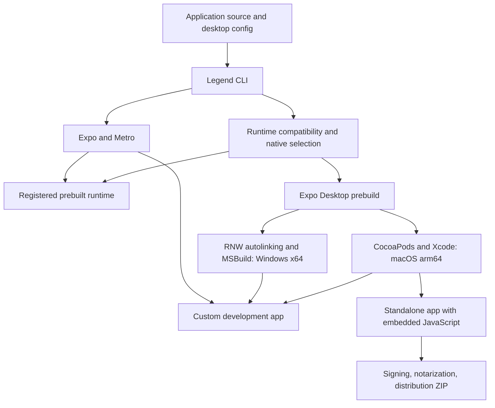

# Architecture

This document explains the current Legend Framework source, its ownership boundaries, and the constraints that changes must preserve. Start with [README.md](README.md) for setup and application usage. Feature guides under [docs](docs) contain API details and dated validation evidence.

The implementation is a local macOS 14+ / Apple Silicon prototype with an integrated Windows x64 development adapter. Windows prebuilt and custom builds use the shared framework flow, but native Windows acceptance remains pending. Production Windows builds and SDK parity are not implemented. Treat original plans and older prototype reports as historical context when a newer implementation or validation report supersedes them.

## Purpose and system boundaries

Legend supplies a desktop application framework on top of React Native and Expo Desktop. The central workflow is:

1. Start an application in a compatible prebuilt runtime.
2. Detect when app-specific native dependencies or configuration require a custom development binary.
3. Build a standalone app from a production-selected native dependency graph.
4. Prepare a signed distribution artifact through a separate packaging workflow.

React Native owns the renderer and JavaScript/native integration. Hermes executes application JavaScript. Expo/Metro provide bundling and the development server. Expo Desktop provides desktop-aware configuration, native project templates, and prebuild. Legend owns the desktop SDK, host customization, runtime selection, build orchestration, and packaging policy.

Node and Bun execute developer tooling. They are not embedded application runtimes. The child-process API can launch external programs, and helpers can be bundled explicitly; neither implies a Node-compatible application environment.

## Source map

| Area | Source | Responsibility |
| --- | --- | --- |
| CLI routing | [packages/cli/src/index.ts](packages/cli/src/index.ts) | Commands, options, project selection, SDK operations |
| Starter and adoption | [create.ts](packages/cli/src/create.ts), [add-desktop.ts](packages/cli/src/add-desktop.ts), [templates](packages/cli/templates) | Delegate template creation; compose desktop support into an existing Expo app |
| Local registry | [packages/cli/src/local.ts](packages/cli/src/local.ts) | SDK manifests, registered binaries, project discovery, available ports |
| Development session | [packages/cli/src/dev.ts](packages/cli/src/dev.ts), [session-status.ts](packages/cli/src/session-status.ts) | Metro and app process ownership, compatibility checks, target switching, terminal actions |
| Metro integration | [metro.cjs](packages/cli/src/metro.cjs), [metro-gate.cjs](packages/cli/src/metro-gate.cjs), [metro.ts](packages/cli/src/metro.ts) | Worker registration integration, bundle gate, reload protocol |
| Native graph | [packages/cli/src/project.ts](packages/cli/src/project.ts) | Installed-package discovery, native signatures, compatibility, selection, runtime metadata |
| Platform boundary | [platform.ts](packages/cli/src/platform.ts), [windows.ts](packages/cli/src/windows.ts) | Project target, Windows pins, JS tool entrypoints, native preparation and development build |
| Build orchestration | [packages/cli/src/build.ts](packages/cli/src/build.ts) | Production analysis, generation, dependency installation, compilation, artifact metadata |
| Configuration | [packages/config-plugin](packages/config-plugin) | Desktop config validation, generated Expo config, identity, entitlements, CNG hooks |
| Application host | [packages/desktop-host](packages/desktop-host), [packages/desktop-app](packages/desktop-app) | macOS AppDelegate and core lifecycle; Windows host hooks in `desktop-host/windows` |
| SDK facade | [packages/desktop/package.json](packages/desktop/package.json) | Public subpath exports for framework-owned APIs |
| Feature implementations | Other directories under [packages](packages) | TypeScript API, native source, codegen, native dependency metadata |
| Packaging | [package.ts](packages/cli/src/package.ts), [signing.ts](packages/cli/src/signing.ts), [credentials.ts](packages/cli/src/credentials.ts), [updates.ts](packages/cli/src/updates.ts) | Release staging, credential selection, signing, resumable notarization, updater feed integration |
| Local distribution | [scripts/pack.ts](scripts/pack.ts), [scripts/prepare-runtimes.ts](scripts/prepare-runtimes.ts) | Content-addressed archives, patched upstream source, SDK registration |
| Validation | [tests](tests), [fixtures](fixtures), [scripts](scripts), [examples](examples) | Unit/config/codegen checks, native fixtures, external consumers, interactive examples |

Directory names do not always match published package names. In particular, `packages/config-plugin` is the `@legend-apps/desktop-config` package. `packages/desktop-windows` implements application windows; its name does not mean Microsoft Windows support.

## Application creation and local distribution

The CLI ships complete macOS, Windows, and universal template sources under `templates/`. Each owns its dependencies, scripts, source, and configuration defaults. The pack step resolves local SDK archive references and produces ordinary npm template tarballs listed in `artifacts/packages/templates.json`.

`legend create` selects a template and invokes the pinned `expo-desktop create-app --template` command. Expo Desktop owns directory/name validation, extraction (including `gitignore` renaming), native identifiers, dependency installation, and Git initialization. A template postinstall initializes only Legend's canonical configuration once, using the upstream-assigned name, bundle identifiers, and project GUID. It preserves later user configuration edits. Application directories follow Expo Desktop's alphanumeric basename requirement; parent directories can contain spaces.

The current distribution mechanism is local tarballs. `scripts/pack.ts` writes content-hashed SDK archives and template archives under `artifacts/packages`, then registers the SDK manifest under the local Legend home. Templates use absolute local archive references during this unpublished development phase; moving a template alone does not distribute the SDK. Repack on the destination machine.

`~/.legend` is the default global registry; `LEGEND_HOME` overrides it. SDK records are versioned. Runtime registration records a path rather than copying an application. The managed prebuilt build project is created under the Legend home unless a project is supplied explicitly. App-local `.legend` data and the global Legend home are different scopes.

The template manifests and `scripts/prepare-runtimes.ts` are the authoritative pins. We remain on Expo Desktop `1.0.0-beta.5` and native template `54.81.1-beta.5`, with Expo 54.0.37, React Native 0.81.6, React Native macOS 0.81.7, and React Native Windows 0.81.35. Creation uses a subprocess-scoped npm 11 executable because beta.5 misreads npm 12's local-tarball metadata. Bun still installs dependencies. This compatibility adapter does not patch upstream or change the host npm installation.

Windows uses its own complete application template, with no runtime removal/replacement of macOS source files. Windows SDK packing does not prepare the macOS Runtimes patch; it preserves an existing archive when available and omits the macOS app template if that archive is absent.

Direct `expo-desktop create-app --template` consumption is validated against local archives. Public runtime acquisition remains separate. See the [integration handoff](docs/expo-desktop-integration.md) for delegated responsibilities, beta limitations, and checks.

## Configuration and identity

Existing Expo apps can opt into an Expo-owned configuration mode through `legend add desktop`. Their `desktop.config.json` declares `extends: "expo"` and contains only desktop options, target declarations, and stable identity. `withLegendExpo` composes the original dynamic/static Expo config for desktop builds and shared Legend development sessions. Expo's installed config reader evaluates the app's original logic; ordinary mobile/web Expo commands retain their existing behavior. Metro and React Native exports are composed in place, and Expo's virtual entry resolver preserves `package.json` main for desktop launches. See [existing Expo integration](docs/add-desktop.md) for automatic-composition limits and validation.

For new apps, `desktop.config.json` is the canonical source. [config.cjs](packages/config-plugin/config.cjs) validates it and produces the Expo `app.json` transport file. Existing static `app.json` projects remain readable when desktop config is absent. Single-target desktop-config projects reject competing dynamic Expo config files. Universal starters use the managed dynamic config described below.

The project ID is stable application identity. It scopes data directories, settings, Keychain service names, recent documents, window restoration, and single-instance behavior. Renaming an app should not change its ID. Independently cloned apps should receive different IDs when their data and instances should be independent.

The prebuilt runtime receives project identity and supported window options from the launching CLI. Custom and standalone apps embed their identity/configuration during native generation. Application identity is separate from the generic prebuilt binary's own bundle identity.

Native configuration has real binary consequences. URL/document registration, helpers, menu-bar-only activation, update settings, additional plugins, and native capability changes can require a custom build. Runtime compatibility must consider these inputs as well as installed module names.

Project namespacing is not a security boundary. Native filesystem/process APIs retain their implemented OS access; do not describe projects using the prebuilt runtime as sandbox-isolated applications. See the [SDK identity guide](docs/sdk.md#app-identity-and-storage).

## Runtime targets and application lifecycle

There are four internal build modes:

| Mode | Native selection | Build configuration | JavaScript source |
| --- | --- | --- | --- |
| `go` | Generic installed SDK/native set | Debug | Metro development bundle |
| `dev` | Installed SDK plus app-specific native dependencies | Debug | Metro development bundle |
| `preview` | Production-selected native set | Debug | Metro bundle requested with production JS settings |
| `release` | Production-selected native set | Release | Embedded `main.jsbundle` and assets |

Bare `legend build` selects `release`. `--preview` is useful for inspecting native pruning with a Debug binary; it is not the standalone distribution mode. Packaging consumes the standalone release and works on a separate staging copy.

The current macOS host configures a React Native factory and mounts the registered `main` component. Secondary windows mount additional React roots from the same application entry bundle. Root props identify the window and project. Module-level JavaScript state is shared across those main-runtime roots; React component state belongs to each root. Secondary window closure stops that surface. The main window can remain mounted while hidden/closed, and closing all windows does not automatically quit the application.

App/window close guards, incoming launch events, and single-instance forwarding are part of the native lifecycle. Their ordering and cleanup matter: an API implementation must not outlive its owning window or deliver the same queued/live launch event twice. See [windows and lifecycle](docs/sdk.md#windows-and-lifecycle).

## Development session and compatibility

`legend dev` supervises the installed Expo CLI and the native application it launches. Expo inherits the terminal and owns its keyboard handling, command table, prompts, Metro, reload, debugger, and mobile/web actions. A version- and source-checked process-local patch adds `d` (open desktop), `g` (switch desktop runtime), and `b` (build when required). JSON IPC carries desktop actions/results and runtime status between Expo under Node and the Legend supervisor under Bun; there is no second stdin handler. Metro workers skip the inherited preload. Closing Expo closes the owned app. Ordinary Expo commands outside this launcher are unpatched. Expo chooses its host and port (LAN and 8081 by default); IPC reports the actual Metro port for desktop launches. Legend consumes only `--project`, `--platform`, `--prebuilt-binary`, and `--no-open`, forwarding Expo options unchanged. Expo’s boolean `--go` keeps its mobile meaning. It can discover registered prebuilt binaries or reuse a recorded custom build; the selected target is remembered per project.

The public shared-client name is **prebuilt runtime**. Legacy `build-go`/`--go-binary` commands alias the new `build-prebuilt`/`--prebuilt-binary` spellings. Persisted `"go"` mode values and existing build/registry paths remain stable; this is a terminology change, not a runtime schema migration.

Each binary embeds `legend-runtime.json`. The current schema contains the framework version, platform, architecture, mode, native package signatures, and a build fingerprint. Runtime discovery also validates the expected application layout. The supported layouts are macOS/arm64 (`Contents/Resources/legend-runtime.json` inside a `.app`) and Windows/x64 (`legend-runtime.json` alongside `MyApp.exe` and its DLLs). Prebuilt runtime discovery filters by platform before checking module signatures; it must never select a macOS binary for a Windows project.

Native signatures include package metadata, native sources/specs, relevant configuration, and host integration. The build fingerprint additionally includes pinned framework/runtime versions, app configuration, and helper inputs. Matching a semver range is not sufficient proof of native compatibility.

Keep three decisions distinct:

1. **Can the existing binary execute this app?** Check required native signatures and native configuration against the target.
2. **Must native projects/dependencies be regenerated?** Compare preparation inputs and required generated state.
3. **Must the app be compiled again?** Compare the complete build fingerprint and artifact presence.

The session watches dependency/configuration files and also reevaluates state periodically. It suspends desktop bundle delivery while compatibility is unresolved. `metro-gate.cjs` selects session state from the request’s `platform` and rejects incompatible desktop bundle/delta requests. Mobile/web requests bypass the desktop gate, and desktop discovery errors do not stop their server. A build or export outside a managed live session does not use that session gate.

**The HTTP gate alone is insufficient.** An already connected Fast Refresh websocket can deliver new code without another bundle request. When native compatibility becomes invalid, the session stops the application process it owns. Preserve that behavior when changing target selection or launch adapters.

A user-selected build action performs native work. Dependency watcher events do not automatically compile. A changed dependency or Metro configuration can require a managed server restart, including when desktop is incompatible; mobile/web must receive the new configuration too. Switching targets launches another binary and may reset state; it does not retrofit native modules into the existing prebuilt process.

The macOS launcher supplies both `LEGEND_BUNDLE_URL` and React Native's packager location. These serve different native connections. It launches the exact executable inside the chosen `.app` to retain process ownership. Replacing this with an upstream launch command requires equivalent connection, failure, and cleanup behavior.

The Windows launcher starts the exact saved `MyApp.exe` with the product directory as its working directory. `LEGEND_METRO_PORT` configures the host’s bundle connection; project identity is supplied by the same launching CLI. The Windows template keeps the native project/executable name `MyApp` while configuring display identity separately.

## Native generation and build ownership

For macOS, Expo Desktop prebuild expands the pinned bare-minimum template. Legend's config plugin supplies the host AppDelegate and generated identity/entitlements. CocoaPods and React Native codegen resolve the selected native dependencies; Xcode builds the resulting workspace for arm64.

The generated `macos` project is disposable. Implement durable changes in feature packages, host source, config, and config plugins. Manual edits to generated Xcode files will not survive a clean prebuild.

The CLI owns its generated `react-native.config.js` selection bridge and refuses to overwrite an unrelated one. A custom configuration needs explicit composition rather than losing the selection constraints. The build also applies exclusions to Expo autolinking and removes stale generated bindings when the graph changes.

Build outputs are copied to an app-local product directory, checked for required bundle contents, given runtime metadata, and ad-hoc signed for local use. Successful build records enable reuse. A per-project build lock prevents concurrent compilation from mutating the same generated graph.

For Windows, `build.ts` retains the shared build lock, result records, and prebuilt registration, then dispatches to `windows.ts`. The config plugin’s Windows branch injects `desktop-host/windows/runtime.inc` into the upstream Win32 host, embedding the same runtime metadata as the build record. RNW owns autolinking, codegen, restore, and MSBuild invocation. Windows tool commands execute the package’s JS entrypoint through Node rather than treating `.cmd` shims as executable JavaScript.

Windows builds support only `go` and `dev`. The adapter removes the packaging project from the development solution and configures the executable for unpackaged Windows App SDK use. It copies the entire output directory into independent prebuilt/dev product directories and writes the shared metadata and build record only after a successful build. Preserving DLLs is required; an executable alone is not a complete runtime. This does not establish clean-machine distribution.

## Production module selection

Production selection starts from the application JavaScript graph resolved by Metro for macOS with production settings. The current analyzer uses the exported source map's resolved sources to associate reachable code with installed native packages. It is not source-text import searching or runtime usage tracking.

Selection retains:

- Native packages reachable from the production app graph.
- Explicit native-only inclusions from app configuration.
- Required native dependency closure, including declared native requirements and relevant non-optional package dependencies/peers.
- Unrecognized/non-prunable native packages conservatively.

Framework SDK packages are eligible for pruning. Selected integrations such as WebView, SQLite, Runtimes, and Nitro are also explicitly recognized. The small core app-context module is deliberately retained; it supports host startup even when application code does not import its API directly.

The resulting selection must agree across generated config, autolinking, codegen, native compilation, runtime metadata, and final JavaScript. Leaving an excluded package in a project reference or generated binding defeats pruning. Removing a required package produces a broken binary.

Development compatibility follows required dependency edges. Optional peers become native requirements only when reachable through another required edge, such as an explicit application dependency; an optional mobile backend found in a parent workspace must not make the desktop prebuilt runtime incompatible.

This removes complete native modules. It does not promise individual native-method elimination, arbitrary third-party tree shaking, or export-level JavaScript dead-code elimination. An import inside a reachable module can retain a dependency even if an exported function is never called. Keep all application screens reachable from the main entry; disconnected bundles and arbitrary native lookup are outside this analyzer's supported model.

Test-only packages must not ship in prebuilt or distribution artifacts. Keep them in explicit custom test builds, and retain the build-time rejection of prohibited fixture modules.

## Universal application target selection

The [shared Settings starter](docs/universal-settings.md) owns one application source and manifest for five targets. It uses the existing desktop session/build pipeline and Expo's mobile/web pipeline. Styling remains an application concern: the starter wraps the existing Metro factory with Uniwind, owns its Tailwind theme tokens, and uses optional `@legend-apps/ui/uniwind` bindings for native control layout. The base UI contract stays `style` and does not import Uniwind. See [styling](docs/styling.md). The starter has an ordinary Expo root entry; Runtimes and Router integration are not part of this slice.

`desktop.config.json.platforms` describes application support. Native builds select one target through `LEGEND_PLATFORM`, merging shared `expo` configuration with `expoByPlatform[target]` without mutating either. `dev --platform` only chooses the initial launch; desktop build/signature state remains separate. The Expo child receives `LEGEND_DEV_SESSION=1`: its dynamic config exposes every declared platform, uses shared `expo` settings, and omits build overlays/native-selection exclusions. Metro uses Expo Desktop’s multi-platform defaults and resolves each request’s platform independently. Root Metro and React Native configuration are not replaced when switching. Mobile autolinking excludes AppKit pods, and desktop configuration excludes the mobile-only Expo backends.

Universal desktop state paths are `.legend/platforms/<target>/...`, including native selection, sessions, build fingerprints, products, and logs. Single-target projects retain their existing paths. Build adapters restore the root manifest after upstream generation, including failure; native generation must run sequentially because upstream temporarily writes shared files. Selected native projects can change during prebuild, while other platform directories remain intact. Configuration preservation does not imply preservation of live React state across processes.

Windows adapters with explicit platform entry points can coexist in a universal dependency graph without pretending to supply native capabilities. The Settings screen renders on Windows without a platform exclusion. WinUI Button/TextBox/ComboBox and clipboard, credential, linking, and file-dialog backends now have Windows implementations. UI initialization failures render visible, noninteractive placeholders; unfinished capabilities still report unavailability. Native Windows acceptance is pending. Track missing implementations and native verification in [known Windows issues](docs/windows-issues.md). Desktop-only projects retain the stricter rejection of unsupported native dependencies.

## External libraries and background runtimes

[`@legend-apps/ui`](docs/ui.md) uses the same contract/adapter boundary for native controls. Its initial controls are `Button`, uncontrolled `TextInput`, and value-based `Select`: AppKit Fabric components on macOS, Expo UI SwiftUI/Compose adapters on mobile, native HTML controls on web, and WinUI controls with visible unavailable-state fallbacks on Windows. The capability package is installed separately; it does not require consumers to adopt a framework layout or routing system.

The framework owns a curated set of public capability contracts, with replaceable platform implementations. The [clipboard, secure-storage, and linking adapters](docs/expo-api-adapters.md) are implemented; they use existing native desktop backends and selected Expo backends on mobile/web, with explicit platform gaps. The [universal API plan](docs/universal-api-plan.md) retains the deferred broader UI and Router-based window proposals. The earlier [API structure review](docs/api-structure-review.md) is historical; its source inventory remains useful.

External libraries retain their upstream APIs and attribution. Shared behavior across different platform backends can justify a framework adapter; integration, version pinning, prebuilt inclusion, and pruning alone do not. An upstream implementation can replace ours when it satisfies the supported contract and acceptance checks, preserving application imports and behavior. See [external libraries](docs/external-libraries.md) for ownership, replacement criteria, and migration paths.

Margelo Runtimes is imported directly as `@react-native-runtimes/core`. The pack step fetches a pinned revision, applies the separate macOS and integration patches, and creates an ordinary dependency archive. Consumers do not need a Git checkout or patch hook. The recipe and patch inputs contribute to archive identity.

The Metro wrapper and worker-aware entry arrange task registration without mounting the main app in a worker. In production the build first discovers reachable sources with registrations suppressed, then generates registrations from that graph and bundles again. This prevents unused task files or development-generated registrations from retaining the entire Runtimes dependency graph. Worker-only imports still contribute their native requirements.

Independent runtimes have separate heaps inside one OS process. They are not process isolation, an OS service, or a shared-global-state mechanism. Use upstream serialization semantics and await outstanding work before destruction. Native filesystem use has specific validation; UI-owned or singleton/event-emitter modules need separate multi-runtime verification. Main-app reload destroys workers before the application restarts.

Follow [Runtimes](docs/runtimes.md) and its [current validation](docs/runtimes-validation.md). The earlier custom-build prototype document is historical; a successful prototype does not establish every lifecycle or native-library combination.

## Signing, packaging, and updates

`legend build` produces a locally runnable application. `legend package` adds the distribution workflow: credential preflight, release build/reuse, signing a staging copy, notarization submission/resumption, stapling, ZIP extraction, and final verification. Keychain identities/profiles are referenced by configuration; private credentials do not belong in application source.

A pending submission is durable state. Preserve its immutable upload, submission identity, and hash checks. An uncertain upload must not be submitted again blindly. Package changes and signature changes affect whether a saved result can be reused.

The updater uses Sparkle on macOS and signed whole-application updates. It is not JavaScript-only OTA delivery. Feed/archive signing and updater initialization have their own validation; actual production installation/relaunch and real Developer ID/notarization acceptance remain separate gates in the current reports.

See [packaging](docs/packaging.md) and [desktop integrations](docs/desktop-integrations.md). Build success, ad-hoc signature verification, simulated notarization, and accepted production distribution are distinct levels of evidence.

## Generated state and diagnostics

| Location | Meaning |
| --- | --- |
| `artifacts/packages/manifest.json` | Local package-name-to-archive map |
| `~/.legend/sdks/`, `~/.legend/runtimes/` | Global registrations, or equivalents under `LEGEND_HOME` |
| App `.legend/settings.json` | Remembered runtime target/preferences |
| App `.legend/session.json` | Live compatibility state consumed by the Metro gate |
| App `.legend/native-selection.json` | Selected/excluded native modules consumed by build integration |
| App `.legend/selection-report.json` | Selection reasons and resolved production sources |
| App `.legend/analysis/` | Bundle/source map and worker reachability analysis outputs |
| App `.legend/windows-build-input.json` | Runtime metadata compiled into the Windows host during prebuild |
| App `.legend/windows-verification.json` | Windows verification stages and native reports; distinguishes prepare-only runs |
| App `.legend/native-preparation.json` | Native generation/dependency preparation fingerprint |
| App `.legend/*-build.json` | Successful artifacts and runtime fingerprints |
| App `.legend/commands.jsonl`, `.legend/logs/` | Invoked commands and full process diagnostics |
| App `.legend/products/`, `.legend/DerivedData/` | Local app products and Xcode build outputs |
| App `.legend/packaging/`, `dist/` | Resumable packaging state and final distribution artifacts |
| App `.threaded-runtime/` | Generated worker entry/registration files |
| `docs/evidence/` | Ignored machine-specific validation artifacts |

For a missing runtime, inspect SDK registration and binary metadata. For an incompatibility, compare the selected runtime with the reported native signatures/configuration. For a build failure, inspect command logs and selection before changing native source. For unexpected app size, inspect selection reasons and linked native output. For a pending package, follow the recorded submission state rather than deleting it to force a retry.

## Windows development boundary and remaining work

Windows support is part of the existing framework. `legend create --platform windows`, `legend sdk build-prebuilt --platform windows`, `legend dev`, and `legend build --dev` share project discovery, runtime metadata, registry, compatibility policy, Metro gating, terminal actions, and build records with macOS. There is no second session implementation or external source kit. See the [Windows guide](docs/windows-slice.md) for commands and prerequisites.

The initial target is Windows 11 x64, RNW 0.81.35, New Architecture/Hermes, and the pinned Expo Desktop template. That RNW template uses MSVC v145 / Visual Studio 2026. The starter provides the native host rather than implying that the complete macOS SDK is available on Windows. One desktop target is selected per generated project.

Windows signatures include Windows native sources/project files and host/config integration; generated build outputs and NuGet lockfiles do not invalidate the source signature. Framework/runtime version changes participate in the mandatory host signature. Directly installed native packages without a Windows implementation fail clearly. This remains a constrained development graph, not acceptance of every third-party dependency arrangement or custom native project modification.

The acceptance gate for this slice is deliberately development-only:

1. Create and build/register the baseline through the framework CLI.
2. Launch it through the real `legend dev` session and verify the compiled native host identity and Hermes.
3. Deliver a JavaScript edit through Fast Refresh.
4. Install the existing native-greeting fixture and observe the shared session reject the prebuilt runtime.
5. Use the session’s normal build action, execute the added native API in the custom binary, and verify the saved prebuilt executable was unchanged.

`scripts/test-windows.ts` drives that path and writes a stage report and logs. Its `--prepare-only` mode validates project generation, development bundles, and compatibility changes without claiming native execution. Typechecking, unit tests, packed-consumer generation/bundling, and a live Windows-target Metro gate check have passed on macOS. Compilation, Windows autolinking, native launch, Hermes, and Fast Refresh still require the Windows machine; the native verifier has not yet passed there.

Remaining work includes:

| Area | Outstanding acceptance or implementation |
| --- | --- |
| Native host | Windows execution, activation/single-instance behavior, lifecycle and window-option semantics beyond the starter |
| SDK and external libraries | Windows implementations and validation of individual APIs; separate checks for WebView, SQLite, Nitro, and Runtimes |
| Runtime distribution | Dependency-complete downloadable clients and clean-machine launch without a compiler/IDE |
| Production | Windows Metro reachability, reduced native graphs, embedded bundles, and standalone launch without Metro |
| Packaging | Installer/MSIX choice, signing, runtime deployment, updates, uninstall, and data preservation |
| Coverage | Windows CI and interactive tests, DPI/multiple monitors, accessibility/input, and a separate ARM64 matrix |

Production analysis must use `platform=windows`; macOS reachability cannot justify Windows pruning. Application APIs also need explicit Windows semantics for menus, shortcuts, window coordinates, last-window closure, and unsupported macOS-only options.

The current adapter uses Expo Desktop prebuild and RNW tools without an upstream change. Coordinate the future generic prebuilt-binary launch contract through the [integration handoff](docs/expo-desktop-integration.md); `expo-desktop run ... --binary` is not assumed to exist in the pinned CLI. Windows App SDK deployment decisions should follow [Microsoft’s RNW architecture guidance](https://github.com/microsoft/react-native-windows-samples/blob/main/docs/new-architecture.md) and [deployment documentation](https://learn.microsoft.com/en-us/windows/apps/windows-app-sdk/deployment-architecture) for the selected versions.

## Working on this repository

Before changing implementation, inspect the current code, package scripts, relevant feature guide, and dated validation report. Check Git status: multiple tasks may share the checkout, and uncommitted files can represent separate work. Preserve unrelated edits and keep commits scoped to the requested change.

Useful starting points:

| Change | Read first | Relevant validation |
| --- | --- | --- |
| Starter or dependency pins | `create.ts`, template, pack scripts | Pack/install a fresh external consumer, typecheck its source, start Metro |
| Runtime detection or switching | `dev.ts`, `local.ts`, `project.ts`, Metro gate | Compatibility tests plus native source-change and target-switch scenarios |
| Desktop feature | Public subpath, owning package/spec, host/config dependencies | API/codegen tests and native behavior, including cleanup and errors |
| Production size or native dependencies | `analyze`, `selection`, build exclusions | Selection report, generated projects/bindings, linked binary, retained API execution |
| Runtimes integration | Metro wrapper, worker entry, source recipe/patches | prebuilt/dev/release execution, reload cleanup, worker-only dependencies, unused-runtime pruning |
| Packaging/updater | Packaging state machine, signing/config modules | Mocked failure/retry tests and the explicitly scoped real release acceptance |
| Windows development | `platform.ts`, `windows.ts`, Windows config/host hooks, native-greeting fixture | `test:windows:prepare` locally; `test:windows` on Windows x64 |
| Production on a new platform | Remaining platform work above and upstream template | Native production build, clean-machine launch, reduced standalone artifact |

Begin with `bun run typecheck` and `bun test tests` where appropriate. Native tests need the platform toolchain and sometimes an interactive desktop. `bun run test:all` includes costly native builds; inspect its current definition before running it. A locked GUI or unavailable UI driver is a validation limitation, not a passing interactive test.

Keep these invariants intact:

- Incompatible native binaries must not receive new app code through an already-open development connection.
- Native changes are authored in durable package/config/host source, not only in generated projects.
- One selected module set must govern native generation, linking, runtime metadata, and required JavaScript capabilities.
- Unknown native dependencies are retained conservatively; test fixtures are excluded from shipping targets.
- App identity remains stable, while projects using the prebuilt runtime retain independent storage and process identity.
- Runtime/platform versions and native signatures determine compatibility; a reload cannot supply missing native code.
- Production packaging retries preserve submission identity and immutable artifact checks.
- Upstream APIs retain ownership and attribution; framework wrappers require framework-specific behavior.

Update README for user-facing workflow/status changes, this document for architecture/invariant changes, and feature guides for API details. Record verification with its date, target, and limits. Do not turn a plan, an implementation, or a mocked test into a claim of completed native acceptance.

## Shared application and SDK transfer

`legend create MyEditor --example document-editor` creates a [shared document editor](docs/document-editor.md) using Expo adapters on mobile, browser file operations on web, and native desktop dialogs. The macOS example exercises windows, menus, shortcuts, file-open events, and unsaved-change guards. Windows includes native control/API/file-dialog implementations, with remaining native acceptance and lifecycle gaps listed in [known Windows issues](docs/windows-issues.md).

[SDK export/import](docs/sdk-distribution.md) packages the CLI, module archives, and optional prebuilt runtimes into a transferable directory. The recipient installs it without this checkout; Expo Desktop beta still owns creation and desktop generation, and Legend retains native compatibility checks.

## Small application examples

[Notes Lite, Music Lite, and Diff Lite](docs/example-apps.md) are standalone universal
CLI examples, created with `legend create MyApp --example notes-lite` (or
`music-lite` / `diff-lite`). They share application models and screens, with
platform files for native lifecycle, selected-file access, and playback. Source
ships with the CLI and depends only on public package imports.

The examples use upstream AsyncStorage with project-scoped keys and recoverable
snapshots. The unpackaged Windows host configures its supported database-path
override. The small [audio contract](docs/audio.md) delegates to Expo Audio on
mobile, AVPlayer on macOS, MediaPlayer on Windows, and HTML audio on web. Queue and
note models remain application-owned. The maintained prebuilt profile now includes audio
and AsyncStorage; existing clients require a rebuild for those native additions.

Windows host source also supplies window roots sharing the host's React runtime,
close/quit guards, focused shortcuts, basic menus, frame restoration, and launch
forwarding. Native compilation and acceptance remain tracked in
[known Windows issues](docs/windows-issues.md); generated bundles do not prove them.
See [extension development](docs/extensions.md) for adding a native library or
replacing a backend while preserving a framework contract.
