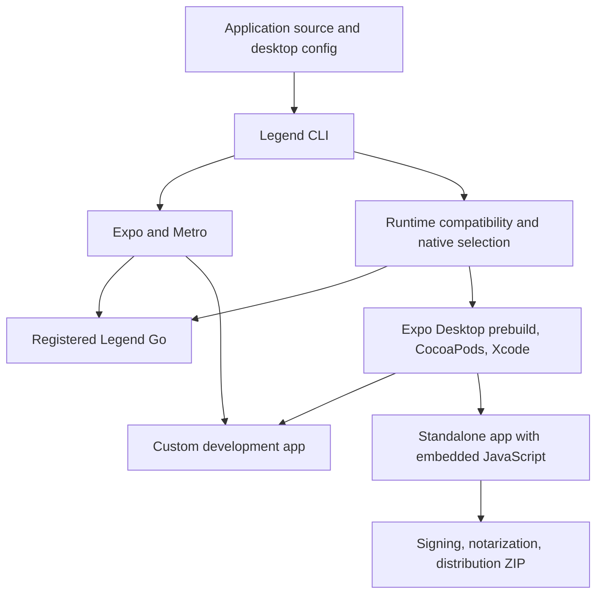

# Architecture

This document explains the current Legend Framework source, its ownership boundaries, and the constraints that changes must preserve. Start with [README.md](README.md) for setup and application usage. Feature guides under [docs](docs) contain API details and dated validation evidence.

The implementation is a local macOS 14+ / Apple Silicon prototype. The Windows section is a development roadmap, not a description of an already integrated Windows backend. Treat original plans and older prototype reports as historical context when a newer implementation or validation report supersedes them.

## Purpose and system boundaries

Legend supplies a desktop application framework on top of React Native and Expo Desktop. The central workflow is:

1. Start an application in a compatible generic Legend Go binary.
2. Detect when app-specific native dependencies or configuration require a custom development binary.
3. Build a standalone app from a production-selected native dependency graph.
4. Prepare a signed distribution artifact through a separate packaging workflow.

React Native owns the renderer and JavaScript/native integration. Hermes executes application JavaScript. Expo/Metro provide bundling and the development server. Expo Desktop provides desktop-aware configuration, native project templates, and prebuild. Legend owns the desktop SDK, host customization, runtime selection, build orchestration, and packaging policy.

Node and Bun execute developer tooling. They are not embedded application runtimes. The child-process API can launch external programs, and helpers can be bundled explicitly; neither implies a Node-compatible application environment.

## Source map

| Area | Source | Responsibility |
| --- | --- | --- |
| CLI routing | [packages/cli/src/index.ts](packages/cli/src/index.ts) | Commands, options, project selection, SDK operations |
| Starter | [packages/cli/src/create.ts](packages/cli/src/create.ts), [templates](packages/cli/templates/blank-typescript) | Copy starter assets, assign identity, resolve local archives, install dependencies |
| Local registry | [packages/cli/src/local.ts](packages/cli/src/local.ts) | SDK manifests, registered binaries, project discovery, available ports |
| Development session | [packages/cli/src/dev.ts](packages/cli/src/dev.ts), [session-status.ts](packages/cli/src/session-status.ts) | Metro and app process ownership, compatibility checks, target switching, terminal actions |
| Metro integration | [metro.cjs](packages/cli/src/metro.cjs), [metro-gate.cjs](packages/cli/src/metro-gate.cjs), [metro.ts](packages/cli/src/metro.ts) | Worker registration integration, bundle gate, reload protocol |
| Native graph | [packages/cli/src/project.ts](packages/cli/src/project.ts) | Installed-package discovery, native signatures, compatibility, selection, runtime metadata |
| Build orchestration | [packages/cli/src/build.ts](packages/cli/src/build.ts) | Production analysis, generation, dependency installation, compilation, artifact metadata |
| Configuration | [packages/config-plugin](packages/config-plugin) | Desktop config validation, generated Expo config, identity, entitlements, CNG hooks |
| Application host | [packages/desktop-host](packages/desktop-host), [packages/desktop-app](packages/desktop-app) | AppDelegate, React startup, core app context and native lifecycle |
| SDK facade | [packages/desktop/package.json](packages/desktop/package.json) | Public subpath exports for framework-owned APIs |
| Feature implementations | Other directories under [packages](packages) | TypeScript API, native source, codegen, native dependency metadata |
| Packaging | [package.ts](packages/cli/src/package.ts), [signing.ts](packages/cli/src/signing.ts), [credentials.ts](packages/cli/src/credentials.ts), [updates.ts](packages/cli/src/updates.ts) | Release staging, credential selection, signing, resumable notarization, updater feed integration |
| Local distribution | [scripts/pack.ts](scripts/pack.ts), [scripts/prepare-runtimes.ts](scripts/prepare-runtimes.ts) | Content-addressed archives, patched upstream source, SDK registration |
| Validation | [tests](tests), [fixtures](fixtures), [scripts](scripts), [examples](examples) | Unit/config/codegen checks, native fixtures, external consumers, interactive examples |

Directory names do not always match published package names. In particular, `packages/config-plugin` is the `@legend-apps/desktop-config` package. `packages/desktop-windows` implements application windows; its name does not mean Microsoft Windows support.

## Application creation and local distribution

The starter is bundled inside the CLI's published-file set, at `templates/blank-typescript`. It includes app source, entrypoint, Metro setup, TypeScript config, dependency pins, and package scripts. Its plain `gitignore` asset is renamed to `.gitignore` when copied into an app so packaging does not discard it.

`legend create` resolves a local SDK archive manifest, copies the template, supplies app identity and local dependency paths, prepares configuration, and installs packages. It must work from an installed CLI outside the framework repository. It should not depend on finding source files through a workspace symlink.

The current distribution mechanism is local tarballs. `scripts/pack.ts` writes archives under `artifacts/packages`, includes content hashes in their filenames, writes a manifest, and registers it under the local Legend home. The hash prevents a changed prototype package with the same version from being mistaken for an older cached archive.

`~/.legend` is the default global registry; `LEGEND_HOME` overrides it. SDK records are versioned. Runtime registration records a path rather than copying an application. The managed Go build project is created under the Legend home unless a project is supplied explicitly. App-local `.legend` data and the global Legend home are different scopes.

The starter dependency matrix and `scripts/prepare-runtimes.ts` are the authoritative pins for this workflow. Notable current versions include Expo Desktop beta.5, Expo 54.0.37, React Native 0.81.6, and React Native macOS 0.81.7. Updating a package is a compatibility change, not just a package-manager operation; validate the resulting native binary and external consumer together.

Direct `expo-desktop create-app --template` consumption and public runtime acquisition are not established by the local template extraction. See the [integration handoff](docs/expo-desktop-integration.md).

## Configuration and identity

For new apps, `desktop.config.json` is the canonical source. [config.cjs](packages/config-plugin/config.cjs) validates it and produces the Expo `app.json` transport file. Existing static `app.json` projects remain readable when desktop config is absent. A desktop-config project cannot simultaneously use a dynamic `app.config.js` or `app.config.ts` through this workflow.

The project ID is stable application identity. It scopes data directories, settings, Keychain service names, recent documents, window restoration, and single-instance behavior. Renaming an app should not change its ID. Independently cloned apps should receive different IDs when their data and instances should be independent.

Go receives project identity and supported window options from the launching CLI. Custom and standalone apps embed their identity/configuration during native generation. Application identity is separate from the generic Go binary's own bundle identity.

Native configuration has real binary consequences. URL/document registration, helpers, menu-bar-only activation, update settings, additional plugins, and native capability changes can require a custom build. Runtime compatibility must consider these inputs as well as installed module names.

Project namespacing is not a security boundary. Native filesystem/process APIs retain their implemented OS access; do not describe Go projects as sandbox-isolated applications. See the [SDK identity guide](docs/sdk.md#app-identity-and-storage).

## Runtime targets and application lifecycle

There are four internal build modes:

| Mode | Native selection | Build configuration | JavaScript source |
| --- | --- | --- | --- |
| `go` | Generic installed SDK/native set | Debug | Metro development bundle |
| `dev` | Installed SDK plus app-specific native dependencies | Debug | Metro development bundle |
| `preview` | Production-selected native set | Debug | Metro bundle requested with production JS settings |
| `release` | Production-selected native set | Release | Embedded `main.jsbundle` and assets |

Bare `legend build` selects `release`. `--preview` is useful for inspecting native pruning with a Debug binary; it is not the standalone distribution mode. Packaging consumes the standalone release and works on a separate staging copy.

The current macOS host configures a React Native factory and mounts the registered `main` component. Secondary windows mount additional React roots from the same application entry bundle. Root props identify the window and project. Module-level JavaScript state is shared across those main-runtime roots; React component state belongs to each root. Secondary window closure stops that surface. The main window can remain mounted while hidden/closed, and closing all windows does not automatically quit the application.

App/window close guards, incoming launch events, and single-instance forwarding are part of the native lifecycle. Their ordering and cleanup matter: an API implementation must not outlive its owning window or deliver the same queued/live launch event twice. See [windows and lifecycle](docs/sdk.md#windows-and-lifecycle).

## Development session and compatibility

`legend dev` owns an Expo/Metro child process and the application process it launches. It selects an available port, binds development to localhost, and records the active target/status. It can discover registered Go binaries or reuse a recorded custom build; the selected target is remembered per project.

Each binary embeds `legend-runtime.json`. The current schema contains the framework version, platform, architecture, mode, native package signatures, and a build fingerprint. Runtime discovery also validates the expected application layout. Today those checks explicitly target macOS/arm64.

Native signatures include package metadata, native sources/specs, relevant configuration, and host integration. The build fingerprint additionally includes pinned framework/runtime versions, app configuration, and helper inputs. Matching a semver range is not sufficient proof of native compatibility.

Keep three decisions distinct:

1. **Can the existing binary execute this app?** Check required native signatures and native configuration against the target.
2. **Must native projects/dependencies be regenerated?** Compare preparation inputs and required generated state.
3. **Must the app be compiled again?** Compare the complete build fingerprint and artifact presence.

The session watches dependency/configuration files and also reevaluates state periodically. It suspends bundle delivery while compatibility is unresolved. `metro-gate.cjs` consults `.legend/session.json` and rejects incompatible bundle/delta requests. A build or export outside a managed live session does not use that session gate.

**The HTTP gate alone is insufficient.** An already connected Fast Refresh websocket can deliver new code without another bundle request. When native compatibility becomes invalid, the session stops the application process it owns. Preserve that behavior when changing target selection or launch adapters.

A user-selected build action performs native work. Dependency watcher events do not automatically compile. A changed dependency or Metro configuration can require a managed server restart. Switching targets launches another binary and may reset state; it does not retrofit native modules into the existing Go process.

The macOS launcher supplies both `LEGEND_BUNDLE_URL` and React Native's packager location. These serve different native connections. It launches the exact executable inside the chosen `.app` to retain process ownership. Replacing this with an upstream launch command requires equivalent connection, failure, and cleanup behavior.

## Native generation and build ownership

Expo Desktop prebuild expands the pinned bare-minimum template for macOS. Legend's config plugin supplies the host AppDelegate and generated identity/entitlements. CocoaPods and React Native codegen resolve the selected native dependencies; Xcode builds the resulting workspace for arm64.

The generated `macos` project is disposable. Implement durable changes in feature packages, host source, config, and config plugins. Manual edits to generated Xcode files will not survive a clean prebuild.

The CLI owns its generated `react-native.config.js` selection bridge and refuses to overwrite an unrelated one. A custom configuration needs explicit composition rather than losing the selection constraints. The build also applies exclusions to Expo autolinking and removes stale generated bindings when the graph changes.

Build outputs are copied to an app-local product directory, checked for required bundle contents, given runtime metadata, and ad-hoc signed for local use. Successful build records enable reuse. A per-project build lock prevents concurrent compilation from mutating the same generated graph.

## Production module selection

Production selection starts from the application JavaScript graph resolved by Metro for macOS with production settings. The current analyzer uses the exported source map's resolved sources to associate reachable code with installed native packages. It is not source-text import searching or runtime usage tracking.

Selection retains:

- Native packages reachable from the production app graph.
- Explicit native-only inclusions from app configuration.
- Required native dependency closure, including declared native requirements and relevant non-optional package dependencies/peers.
- Unrecognized/non-prunable native packages conservatively.

Framework SDK packages are eligible for pruning. Selected integrations such as WebView, SQLite, Runtimes, and Nitro are also explicitly recognized. The small core app-context module is deliberately retained; it supports host startup even when application code does not import its API directly.

The resulting selection must agree across generated config, autolinking, codegen, native compilation, runtime metadata, and final JavaScript. Leaving an excluded package in a project reference or generated binding defeats pruning. Removing a required package produces a broken binary.

This removes complete native modules. It does not promise individual native-method elimination, arbitrary third-party tree shaking, or export-level JavaScript dead-code elimination. An import inside a reachable module can retain a dependency even if an exported function is never called. Keep all application screens reachable from the main entry; disconnected bundles and arbitrary native lookup are outside this analyzer's supported model.

Test-only packages must not ship in Go or distribution artifacts. Keep them in explicit custom test builds, and retain the build-time rejection of prohibited fixture modules.

## External libraries and background runtimes

External libraries retain their upstream APIs and attribution. Integration, version pinning, Go inclusion, and pruning do not by themselves justify a new framework wrapper. See [external libraries](docs/external-libraries.md) before adding another facade.

Margelo Runtimes is imported directly as `@react-native-runtimes/core`. The pack step fetches a pinned revision, applies the separate macOS and integration patches, and creates an ordinary dependency archive. Consumers do not need a Git checkout or patch hook. The recipe and patch inputs contribute to archive identity.

The Metro wrapper and worker-aware entry arrange task registration without mounting the main app in a worker. In production the build first discovers reachable sources with registrations suppressed, then generates registrations from that graph and bundles again. This prevents unused task files or development-generated registrations from retaining the entire Runtimes dependency graph. Worker-only imports still contribute their native requirements.

Independent runtimes have separate heaps inside one OS process. They are not process isolation, an OS service, or a shared-global-state mechanism. Use upstream serialization semantics and await outstanding work before destruction. Native filesystem use has specific validation; UI-owned or singleton/event-emitter modules need separate multi-runtime verification. Main-app reload destroys workers before the application restarts.

Follow [Runtimes](docs/runtimes.md) and its [current validation](docs/runtimes-validation.md). The earlier custom-build prototype document is historical; a successful prototype does not establish every lifecycle or native-library combination.

## Signing, packaging, and updates

`legend build` produces a locally runnable application. `legend package` adds the distribution workflow: credential preflight, release build/reuse, signing a staging copy, notarization submission/resumption, stapling, ZIP extraction, and final verification. Keychain identities/profiles are referenced by configuration; private credentials do not belong in application source.

A pending submission is durable state. Preserve its immutable upload, submission identity, and hash checks. An uncertain upload must not be submitted again blindly. Package changes and signature changes affect whether a saved result can be reused.

The updater uses Sparkle on macOS and signed whole-application updates. It is not JavaScript-only OTA delivery. Feed/archive signing and updater initialization have their own validation; actual production installation/relaunch and real Developer ID/notarization acceptance remain separate gates in the current reports.

See [packaging](docs/packaging.md) and [desktop integrations](docs/desktop-integrations.md). Build success, ad-hoc signature verification, simulated notarization, and accepted production distribution are distinct levels of evidence.

## Generated state and diagnostics

| Location | Meaning |
| --- | --- |
| `artifacts/packages/manifest.json` | Local package-name-to-archive map |
| `~/.legend/sdks/`, `~/.legend/runtimes/` | Global registrations, or equivalents under `LEGEND_HOME` |
| App `.legend/settings.json` | Remembered runtime target/preferences |
| App `.legend/session.json` | Live compatibility state consumed by the Metro gate |
| App `.legend/native-selection.json` | Selected/excluded native modules consumed by build integration |
| App `.legend/selection-report.json` | Selection reasons and resolved production sources |
| App `.legend/analysis/` | Bundle/source map and worker reachability analysis outputs |
| App `.legend/native-preparation.json` | Native generation/dependency preparation fingerprint |
| App `.legend/*-build.json` | Successful artifacts and runtime fingerprints |
| App `.legend/commands.jsonl`, `.legend/logs/` | Invoked commands and full process diagnostics |
| App `.legend/products/`, `.legend/DerivedData/` | Local app products and Xcode build outputs |
| App `.legend/packaging/`, `dist/` | Resumable packaging state and final distribution artifacts |
| App `.threaded-runtime/` | Generated worker entry/registration files |
| `docs/evidence/` | Ignored machine-specific validation artifacts |

For a missing runtime, inspect SDK registration and binary metadata. For an incompatibility, compare the selected runtime with the reported native signatures/configuration. For a build failure, inspect command logs and selection before changing native source. For unexpected app size, inspect selection reasons and linked native output. For a pending package, follow the recorded submission state rather than deleting it to force a retry.

## Windows: work beyond module ports

The current primary CLI/config/host/build/package path is macOS-specific. Experimental Windows code in the checkout does not imply that `legend dev`, `legend build`, or `legend package` supports Windows. A Windows integration needs an explicit acceptance report against its exact source and dependency matrix.

The intended workflow can remain the same. The following boundaries need Windows implementations or generalization:

| Workstream | Required outcome |
| --- | --- |
| Foundation | Validate an Expo Desktop/RNW/New Architecture dependency matrix, Windows toolchain, minimum OS, and initial architecture target |
| Native host | Initialize React/Hermes, own window/React-surface lifetime, load Metro or embedded bundles, handle activation and single-instance forwarding |
| CLI platform boundary | Select platform/architecture, discover toolchains and artifacts, launch exact binaries, manage process lifetime, handle Windows executable shims and paths |
| Config | Define Windows app/package identity, supported window semantics, capabilities, URL/file associations, helpers, and startup behavior |
| Native dependency graph | Discover/fingerprint Windows sources and project inputs; coordinate Windows autolinking, codegen, dependency restore, project references, and production selection |
| Runtime distribution | Supply the appropriate executable/dependency set and metadata; run Go without a compiler/IDE on the consumer machine |
| External dependencies | Validate the chosen Windows/New Architecture versions of Expo support, WebView, SQLite, Nitro, and Runtimes individually |
| Application distribution | Choose an installer/package model, deploy runtime dependencies, sign artifacts, preserve app data, implement updates and uninstall behavior |
| Validation | Windows CI plus interactive desktop tests, clean-machine Go/release tests, input/accessibility, DPI/multiple-monitor behavior, and architecture-specific artifacts |

A future platform adapter should handle toolchain detection, native preparation/build, artifact metadata/layout, launch, and packaging. Shared code should continue to own session policy and dependency selection. This adapter boundary is proposed; the current CLI directly calls macOS tools and uses `.app` layouts.

Windows fingerprints must include Windows native sources/project files rather than merely reuse Apple signatures. Production analysis must resolve `platform=windows`; macOS reachability is not evidence for a Windows binary. API parity also needs semantics, such as last-window closure, application menus, shortcut modifiers, coordinate systems, and unsupported platform-only window options.

The first useful acceptance gate is a complete small path: Windows Hello World in Go, one native capability, install an additional native dependency, detect the incompatibility, build/switch to a custom binary, then run a reduced standalone app without Metro on a clean Windows machine. Expand the SDK after that path is proven. Windows 11 x64 is a proposed first validation target, with ARM64 requiring its own results.

Coordinate Expo Desktop template generation and generic prebuilt-binary launch behavior through the [integration handoff](docs/expo-desktop-integration.md). The proposed `expo-desktop run ... --binary` contract is not assumed to exist in the pinned CLI. Windows App SDK host and deployment decisions should be checked against [Microsoft's RNW architecture guidance](https://github.com/microsoft/react-native-windows-samples/blob/main/docs/new-architecture.md) and [deployment documentation](https://learn.microsoft.com/en-us/windows/apps/windows-app-sdk/deployment-architecture) for the selected versions.

## Working on this repository

Before changing implementation, inspect the current code, package scripts, relevant feature guide, and dated validation report. Check Git status: multiple tasks may share the checkout, and uncommitted files can represent separate work. Preserve unrelated edits and keep commits scoped to the requested change.

Useful starting points:

| Change | Read first | Relevant validation |
| --- | --- | --- |
| Starter or dependency pins | `create.ts`, template, pack scripts | Pack/install a fresh external consumer, typecheck its source, start Metro |
| Runtime detection or switching | `dev.ts`, `local.ts`, `project.ts`, Metro gate | Compatibility tests plus native source-change and target-switch scenarios |
| Desktop feature | Public subpath, owning package/spec, host/config dependencies | API/codegen tests and native behavior, including cleanup and errors |
| Production size or native dependencies | `analyze`, `selection`, build exclusions | Selection report, generated projects/bindings, linked binary, retained API execution |
| Runtimes integration | Metro wrapper, worker entry, source recipe/patches | Go/dev/release execution, reload cleanup, worker-only dependencies, unused-runtime pruning |
| Packaging/updater | Packaging state machine, signing/config modules | Mocked failure/retry tests and the explicitly scoped real release acceptance |
| New platform | Windows workstreams above and upstream template | Platform-native build, clean-machine launch, custom-build transition, standalone artifact |

Begin with `bun run typecheck` and `bun test tests` where appropriate. Native tests need the platform toolchain and sometimes an interactive desktop. `bun run test:all` includes costly native builds; inspect its current definition before running it. A locked GUI or unavailable UI driver is a validation limitation, not a passing interactive test.

Keep these invariants intact:

- Incompatible native binaries must not receive new app code through an already-open development connection.
- Native changes are authored in durable package/config/host source, not only in generated projects.
- One selected module set must govern native generation, linking, runtime metadata, and required JavaScript capabilities.
- Unknown native dependencies are retained conservatively; test fixtures are excluded from shipping targets.
- App identity remains stable, while Go projects retain independent storage and process identity.
- Runtime/platform versions and native signatures determine compatibility; a reload cannot supply missing native code.
- Production packaging retries preserve submission identity and immutable artifact checks.
- Upstream APIs retain ownership and attribution; framework wrappers require framework-specific behavior.

Update README for user-facing workflow/status changes, this document for architecture/invariant changes, and feature guides for API details. Record verification with its date, target, and limits. Do not turn a plan, an implementation, or a mocked test into a claim of completed native acceptance.
